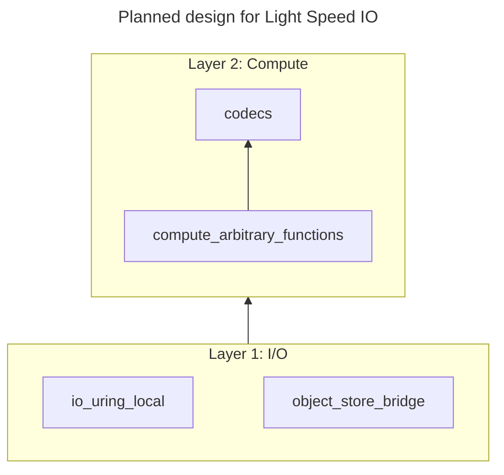

Test diagram:

```mermaid
---
title: Planned design for Light Speed IO
---
graph BT;
    subgraph io_layer[Layer 1: I/O]
        direction LR
        io_uring_local ~~~ object_store_bridge
        end
    subgraph compute_layer[Layer 2: Compute]
        direction BT
        compute_arbitrary_functions --> codecs
        end
    io_layer --> compute_layer
```
