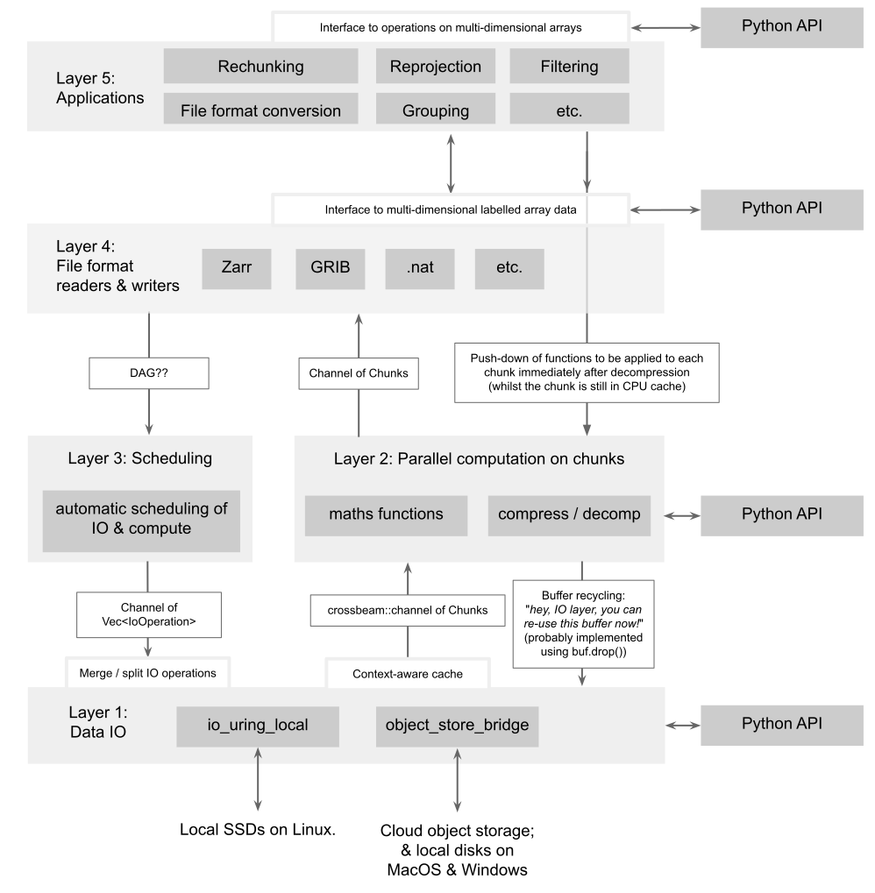

# Planned Design for `light-speed-io`

# Summary

The ultimate aim is to load and process multi-dimensional arrays as quickly and as efficiently as modern hardware will allow!

Why? Initially, to make life as easy as possible for folks who want to train ML models on large multi-dimensional datasets (like weather predictions). Specifically:

- Enable folks to train directly from source datasets (instead of having to prepare batches ahead-of-time) at multiple GB/sec,
- make it as easy as possible to combine different datasets on-the-fly (e.g. NWPs and satellite datasets, see [issue #142](https://github.com/JackKelly/light-speed-io/issues/142)),
- use single on-disk datasets for as many ML experiments as possible (see [issue #141](https://github.com/JackKelly/light-speed-io/issues/141)). Stop people having to manually duplicate data (with different chunking schemes) for each ML model.

LSIO will provide a suite of tools for loading and processing large, labelled, multi-dimensional datasets. Where "large" means datasets that are too large to fit into RAM, and where "labelled" means datasets where each array dimension can be associated with coordinates. For example, a dataset of satellite imagery might have 4 dimensions: x, y, time, and spectral channel. The x and y dimensions might be labelled with longitude and latitude coordinates, respectively.

The main focus will be on processing data on a single machine. Hopefully tools like Dask could schedule LSIO across multiple machines.

Please see [this blog post](https://jack-kelly.com/blog/2023-07-28-speeding-up-zarr) for more details of the background and motivations behind this project.

This git repository contains multiple crates. Each crate implements "just one thing". Each crate will exist in one of five levels of abstraction. And there will be a Python API to each level of abstraction. See the "planned design" diagram below.

## Fitting into the ecosystem
Today, there are many awesome software packages for working with large, labelled, multi-dimensional datasets (such as xarray, fsspec, dask, kerchunk, satpy, etc.). LSIO aims to help speed up this existing stack: Either by providing tools that existing Python packages can hook into, or by providing new tools which play nicely with the existing stack, or by creating new tools with very similar Python APIs to existing Python APIs.

## Why bother to build `light-speed-io`? What gap does it fill?
LSIO is all about computational speed _and_ efficiency! Today, using existing packages, you can achieve high throughput by spinning up a large cluster. But that's expensive, power-hungry, and tedious! The aim of LSIO is to enable high throughput and low latency on a single machine.

To look at this from the users' perspective: one of the main aims is to enable users to far more easily train ML models on huge multi-dimensional datasets.

## How to be efficient and fast?
By being [sympathetic](https://dzone.com/articles/mechanical-sympathy) to the hardware!

That sounds abstract! In concrete terms, one central aim is for the machine to do as little work as possible. Specifically:

Minimise the number of:
- round-trips to RAM,
- system calls,
- heap allocations,
- network requests,
- memory copies.

Maximise the use of:
- CPU caches,
- all the levels of parallelism available within a single machine,
- modern, efficient IO APIs like io_uring.

## Concrete goals
Some example concrete goals include:
- Compute summary statistics of multi-terabyte dataset on a laptop, at a speed of about 5 minutes per terabyte (from a fast local SSD), with minimal RAM requirements.
- Train a large machine learning model from two Zarr datasets (e.g. satellite imagery and numerical weather predictions) at a sustained bandwidth to the GPU of at least 1 gigabyte per second (from local SSDs or from a cloud storage bucket), whilst performing some light processing on the data on-the-fly. Crucially, each ML training example should be a random crop of the multi-dimensional dataset. (Random cropping is particularly slow on today's software stack.)

## Priorities
The first area of focus is on high-speed IO for local SSDs on Linux, to speed up training ML models from sharded Zarr datasets. But we're definitely also interested in helping speed up access to data stored in cloud object storage (see [issue #10](https://github.com/JackKelly/light-speed-io/issues/10)), and in helping to speed up general data analytics tasks on multi-dimensional data.

## How long will this take?
Implementing the complete design sketched out in this doc will take _years_!

By the end of 2024, I hope to have MVP implementations of "level 1 (I/O)" and "level 2 (parallel compute on chunks)" and a basic Zarr implementation for level 4. But please don't hold me to that!

# Which crates would live in this repo? What would they do? And how would they communicate with each other? 

([Original Google Draw version of this diagram](https://docs.google.com/drawings/d/1cpRai2k9y2Y9v4ieaof33FT27uB4JlK_rJL9Lvbj4MM/edit?usp=sharing).)

My hope is to categorise the crates into several different levels of abstraction:

## Abstraction level 1: Data input/output
This is lowest level of abstraction: the level closest to the hardware.

### Common interface
These IO crates will share a common interface: 
- Instructions will be given to the IO crate via a common set of methods, defined in a `Reader` trait and a `Writer` trait. Under the hood, the `lsio_uring` crate will encode each of the user's commands into a `struct`, and put these structs into a multi-producer multi-consumer `crossbeam::channel`. An example of an instruction could be: "get 1,000,000 chunks of `/foo/bar`". These `IoOperation`s will probably be grouped ([#68](https://github.com/JackKelly/light-speed-io/issues/68)), such that the IO crate will guarantee that all operations in group _n_ are completed before any IO operations in group _n+1_ are started.
- Output channel: A multi-producer multi-consumer `crossbeam::channel` of `Chunk`s to return completed data to the user (these will also be grouped) (see [#105](https://github.com/JackKelly/light-speed-io/issues/105)).

LSIO will also enable buffer recycling whereby the user can optionally tell the IO crate "re-use each IO buffer once I've dropped it" (to minimise the number of heap allocations). ([#38](https://github.com/JackKelly/light-speed-io/issues/38)). This will probably be implemented via the `drop` method on `AlignedBytes`.

### Crates
- [ ] `aligned_bytes`
- [ ] `lsio_uring` (this is what I'm currently working on): provide a small threadpool which performs IO using io_uring.
- [ ] [`lsio_io_python_bridge` #39)[https://github.com/JackKelly/light-speed-io/issues/39]
- [ ] [`object_store_bridge` #107](https://github.com/JackKelly/light-speed-io/issues/107) (also see [Ideas for fast cloud storage #10](https://github.com/JackKelly/light-speed-io/issues/10))
- [ ] maybe other crates for high-performance local storage on MacOS and/or Windows.

## Abstraction level 2: Parallel compute on chunks

### Common interface
These crates will all consume the `output channel` from the IO layer.

### Crates
- [ ] `lsio_compute`: Perform parallel computation on data. Users can supply any function to be applied to each chunk. The actual computation will probably be orchestrated by Rayon. This crate will implement functions for operating on the `struct Chunks` that represents each buffer with its metadata (see #105).
- [ ] `lsio_codecs`: Compression / decompression

## Abstraction level 3: Automatically scheduling compute & IO
The aim is to do to as little work as possible to satisfy the user's requests: don't repeat work (if we can avoid it) and don't do work that doesn't contribute to the final outcome.

- [ ] `lsio_scheduler`

## Abstraction level 4: Crates that load / write to a specific file format

These crates will each include a Python API.

### Crates
- [ ] `lsio_zarr_codec_pipeline`: A pure-Rust implementation of [`zarr-python` v3's new `CodecPipeline`](https://github.com/zarr-developers/zarr-python/issues/1806#issuecomment-2085680824), that can be used as a storage and decompression backend for `zarr-python`.
- [ ] `lsio_zarr`
- [ ] `lsio_grib`
- [ ] etc.

## Abstraction level 5: Domain-specific computation

### Crates
- [ ] `lsio_rechunker`
- [ ] `lsio_array`

